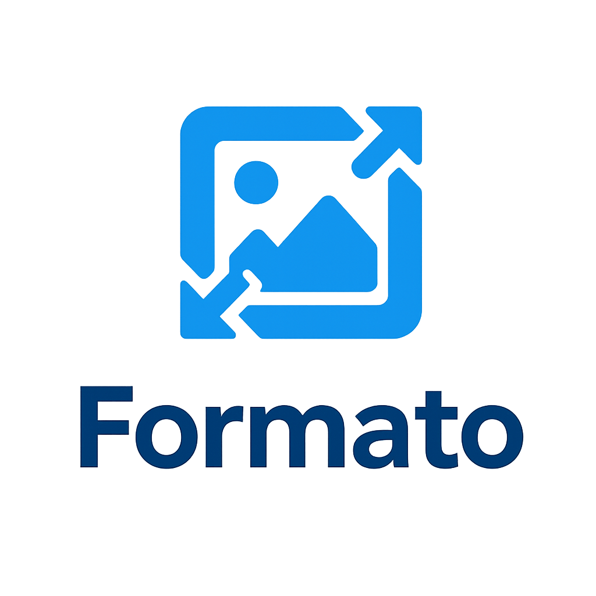

# Formato — Image Format Converter 🖼️



[](https://www.python.org/)
[](LICENSE)

**Formato** is a **cross-platform image format converter** built with Python and Tkinter.  
Convert your images in batch, preserve EXIF metadata, resize images, and export to multiple formats like JPEG, PNG, WEBP, BMP, TIFF — all with a clean GUI.

---

## 🔹 Features

- ✅ Batch image conversion  
- ✅ Support for `JPEG`, `PNG`, `WEBP`, `BMP`, `TIFF`  
- ✅ Preserve EXIF/metadata (best-effort)  
- ✅ Optional resize with aspect ratio  
- ✅ Progress bar & real-time logs  
- ✅ Drag & Drop (Windows) & folder/file selection  
- ✅ Overwrite or save to new folder  
- ✅ Configurable quality (1–100)  
- ✅ Keyboard shortcuts: `Ctrl+O` (open), `Ctrl+Q` (quit)  
- ✅ Minimalist dark/light theme (Tkinter-based)  
- ✅ Desktop & start menu shortcuts via installer (Windows)

---
## 🔹 Installation

### Using `pip`
```bash
git clone https://github.com/MRThugh/Formato-Image-Converter.git
cd Formato-Image-Converter
python -m venv venv
source venv/bin/activate  # Linux / MacOS
venv\Scripts\activate     # Windows
pip install -r requirements.txt
````

### Run the App

```bash
python -m formato.app
# OR
python formato/app.py
```

### Windows Installer

* Run `FormatoSetup.exe` from [Releases](https://github.com/MRThugh/Formato-Image-Converter/releases)
* Choose **Desktop shortcut** if needed
* Launch from Start Menu or Desktop

### Linux AppImage

* Make executable:

```bash
chmod +x Formato-x86_64.AppImage
./Formato-x86_64.AppImage
```

---

## 🔹 Example Usage (CLI / Python)

```python
from formato import converter
from pathlib import Path

src = Path("assets/sample_images/sample1.png")
dst = Path("output/sample1.jpg")

result = converter.convert_image(
    src, dst,
    fmt="JPEG",
    quality=90,
    resize=(800, 600),
    preserve_exif=True
)

print(result)
```

---

## 🔹 Troubleshooting

* **Tkinter errors** → Make sure Python 3.10+ installed with `tkinter` module.
* **Icon not showing** → Ensure `icon.ico` exists in `assets` folder.
* **Permission errors on Windows** → Run installer as Administrator or select a writable folder.
* **Linux AppImage not executing** → `chmod +x Formato-x86_64.AppImage`

---

## 🔹 Contributing

1. Fork the repo
2. Create your feature branch (`git checkout -b feature/NewFeature`)
3. Commit your changes (`git commit -m 'Add some feature'`)
4. Push to branch (`git push origin feature/NewFeature`)
5. Open a Pull Request

---

## 🔹 License

This project is licensed under the **MIT License** — see [LICENSE](LICENSE) for details.

---

> Made with ❤️ by **Ali Kamrani**
