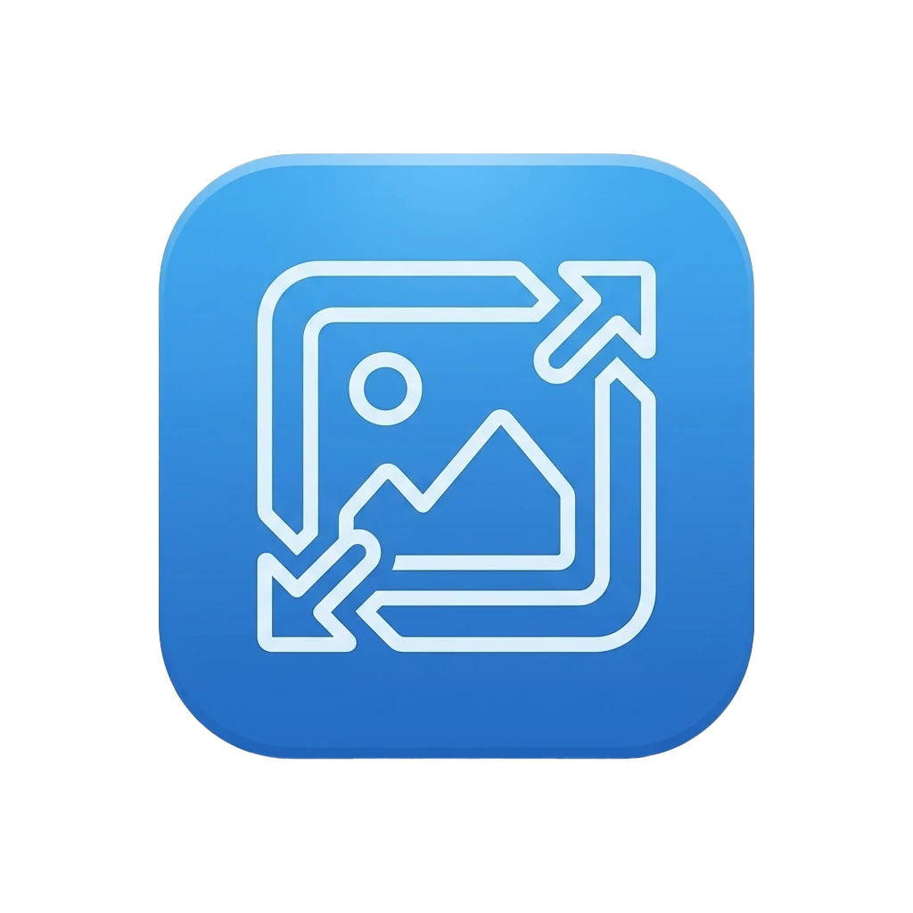
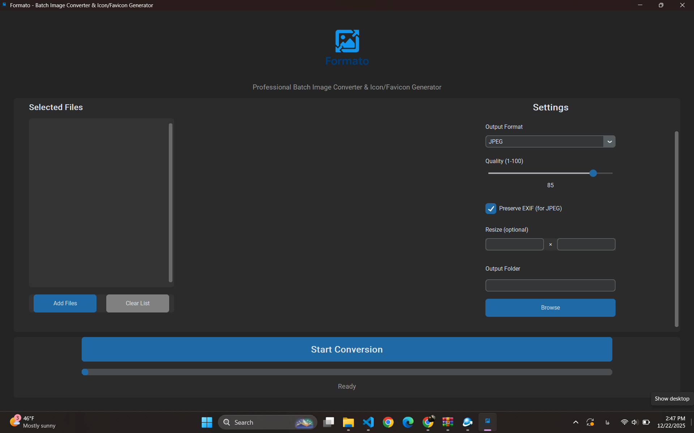
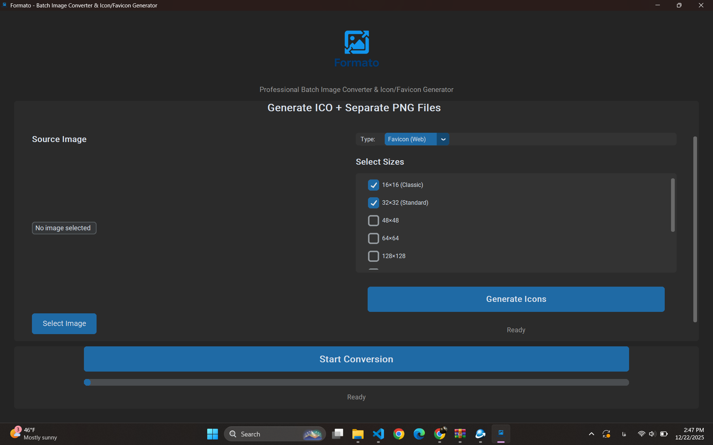

# Formato - Professional Batch Image Converter & Icon/Favicon Generator

**Formato** is a powerful, completely free, and open-source desktop application built with Python that allows you to:

- Batch convert images between multiple formats (JPEG, PNG, WEBP, TIFF, BMP)
- Resize images, adjust quality, and preserve EXIF metadata
- Generate professional **favicons** and **application icons** in all standard and modern sizes
- Create both a single `.ico` file and individual PNG files for each size
- Beautiful, responsive, and modern user interface powered by **CustomTkinter**

---

## Key Features

- Real-time progress tracking during batch conversion
- Full control over output format, quality, resize, and EXIF preservation
- Icon/Favicon generator supporting these sizes:
  - 16×16, 32×32, 48×48, 64×64, 128×128
  - 180×180 (Apple Touch Icon)
  - 192×192 (Android Chrome / PWA)
  - 256×256 (Best compatibility with Windows)
  - 512×512 (Large icon for web app manifest)
- Generates both `.ico` file and separate `.png` files for full flexibility
- Custom logo and icon support
- Standalone executable available (no Python installation required)
- 100% free and open-source

---

## Screenshots

  
  

> Tip: Add your own screenshots to the `screenshots/` folder for a more personalized look.

---

## Download

**[Download the latest release (Windows)](https://github.com/MRThugh/Formato-Image-Converter/releases/latest)**

- Professional installer with custom icon and optional desktop shortcut
- No dependencies or Python installation needed

---

## How to Use

1. Download and run the installer
2. In the **Batch Converter** tab:
   - Click "Add Files" to select images
   - Choose your desired format, quality, and optional resize
   - Select an output folder and click "Start Conversion"
3. In the **Icon/Favicon Generator** tab:
   - Click "Select Image" to choose a source
   - Check the icon sizes you need
   - Choose a save folder and click "Generate Icons"

---

Contributing
Contributions are very welcome! Whether it's bug reports, feature suggestions, or code improvements — feel free to:

Open an Issue
Submit a Pull Request

We appreciate all help in making Formato even better ❤️

Made with ❤️ by MRThugh
⭐ If you find Formato useful, please give it a star — it means a lot!
